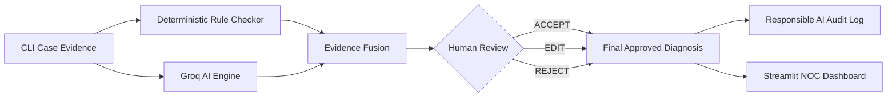

<div align="center">

# ⚡ NetSage AI

### AI-Assisted Cisco Network Troubleshooting & Human Governance

An evidence-driven network diagnosis system combining deterministic Python rules, Groq LLaMA 3.3 reasoning, evidence fusion, and human-in-the-loop governance.

[](https://www.python.org/)
[](https://streamlit.io/)
[](https://groq.com/)
[](https://plotly.com/)
[](https://docs.pydantic.dev/)
[](#-evaluation--test-suite)

[🚀 Quick Start](#-quick-start--setup) • [🖥️ Dashboard](#-streamlit-noc-dashboard) • [📖 Documentation](#-documentation-sitemap) • [🎬 Demo Scenario](#-primary-demo-scenario-case-033)

</div>

---

### 📊 Quick Project Summary

| Core Metric | Project Specification / Real Value |
| :--- | :--- |
| **Troubleshooting Dataset** | **40 Cases** spanning 8 core networking concepts |
| **Deterministic Rules** | **6 Python Rules** (`IF-001`, `IP-001`, `IP-002`, `GW-001`, `VLAN-001`, `ROUTE-001`) |
| **AI Diagnosis Engine** | **Groq LLaMA 3.3 70B** (`llama-3.3-70b-versatile`) |
| **Evidence Fusion** | **4 Agreement Categories** (`AGREE`, `PARTIAL_AGREE`, `CONFLICT`, `INSUFFICIENT_EVIDENCE`) |
| **Human Governance** | **Human Authority Principle** (`ACCEPT`, `EDIT`, `REJECT`) |
| **Responsible AI Log** | **6 Genuine Human Corrections** (`data/responsible_ai_log.csv`) |
| **Operations Dashboard** | **5 Interactive Pages** (Overview, Case Explorer, AI vs Human, Responsible AI, Evaluation) |
| **Automated Test Suite** | **62 Unit & Integration Tests Passed** (100.0% Pass Rate) |

---

## 📋 Table of Contents
- [🎯 The Problem](#-the-problem)
- [💡 The Solution](#-the-solution)
- [🏗️ System Architecture](#-system-architecture)
- [✨ Key Pipeline Phases](#-key-pipeline-phases)
  - [Phase 2: 40 Cases Dataset](#phase-2-40-cases-dataset)
  - [Phase 3: Deterministic Rule Checker Engine](#phase-3-deterministic-rule-checker-engine)
  - [Phase 4: Groq AI Diagnosis Engine](#phase-4-groq-ai-diagnosis-engine)
  - [Phase 5: Evidence Fusion Module](#phase-5-evidence-fusion-module)
  - [Phase 6: Human Review & Governance](#phase-6-human-review--governance)
  - [Responsible AI Audit Log](#responsible-ai-audit-log)
- [🖥️ Streamlit NOC Dashboard](#-streamlit-noc-dashboard)
- [📊 Evaluation & Test Suite](#-evaluation--test-suite)
- [🎬 Primary Demo Scenario (`CASE-033`)](#-primary-demo-scenario-case-033)
- [🚀 Quick Start & Setup](#-quick-start--setup)
- [🛠️ Tech Stack](#-tech-stack)
- [📂 Project Sitemap & Structure](#-project-sitemap--structure)
- [🛡️ Safety Boundary & Limitations](#-safety-boundary--limitations)

---

## 🎯 The Problem

Modern enterprise networks generate massive volumes of CLI diagnostic data when faults occur—such as VLAN mismatches, ACL sequence blocks, default gateway misconfigurations, or routing drops. Traditional manual troubleshooting is slow and error-prone. Pure LLM approaches risk hallucinating syntax or recommending unauthorized configuration changes.

```
TRADITIONAL MANUAL TROUBLESHOOTING:
CLI Evidence ➔ Manual Search ➔ Guess Fault ➔ Manual Trial & Error ➔ Downtime

NETSAGE AI GOVERNED PIPELINE:
CLI Evidence ➔ Deterministic Rules ➔ Groq AI Reasoning ➔ Evidence Fusion ➔ Human Review ➔ Approved Diagnosis
```

---

## 💡 The Solution

NetSage AI is an evidence-driven network troubleshooting assistant that combines deterministic networking rules with LLM reasoning while enforcing **Human Authority** over final approved diagnoses.

<div align="center">

| 01 — VERIFY | 02 — REASON | 03 — REVIEW |
| :--- | :--- | :--- |
| **Python Rules** verify known physical, IP, VLAN, and routing faults without LLM hallucinations. | **Groq LLaMA 3.3** generates structured JSON diagnoses from CLI evidence. | **Human Reviewer** inspects evidence and renders `ACCEPT`, `EDIT`, or `REJECT` decisions. |

</div>

---

## 🏗️ System Architecture



---

## ✨ Key Pipeline Phases

### Phase 2: 40 Cases Dataset
NetSage AI includes a pre-computed lab dataset in [`data/cases.csv`](file:///c:/Users/Omkar/Desktop/CISCO/NetSage-AI/data/cases.csv) featuring 40 troubleshooting cases across 8 core networking categories:
1. **VLAN**: Missing VLAN database entries, trunk encapsulation errors.
2. **Default Gateway**: Subnet mismatches, wrong gateway IP configuration.
3. **DHCP**: Missing `ip helper-address`, scope exhaustion, wrong default-router option.
4. **DNS**: Name server unreachable, misconfigured client DNS.
5. **Routing**: Missing static default route, missing OSPF network statement, asymmetric routing.
6. **ACL**: Extended ACL line sequence order error, explicit deny rule blocking TCP port 80.
7. **NAT**: Missing `ip nat outside` statement on WAN interface.
8. **Wireless**: Disabled WLAN profile on WLC.

### Phase 3: Deterministic Rule Checker Engine
Built in [`rules/`](file:///c:/Users/Omkar/Desktop/CISCO/NetSage-AI/rules/) without external LLM dependencies:
* `IF-001`: Interface Down Check (`PASS`, `FAIL`, `UNKNOWN`)
* `IP-001`: Duplicate IP Address Detection
* `IP-002`: Subnet Mask Alignment
* `GW-001`: Default Gateway Reachability Mismatch
* `VLAN-001`: Missing VLAN Database Entry
* `ROUTE-001`: Missing Routing Table Entry

### Phase 4: Groq AI Diagnosis Engine
Powered by Groq API (`llama-3.3-70b-versatile`) in [`ai/diagnosis.py`](file:///c:/Users/Omkar/Desktop/CISCO/NetSage-AI/ai/diagnosis.py). Enforces JSON schema payloads containing:
* `root_cause`: Concise root cause analysis
* `confidence`: Model confidence score (0.00 to 1.00)
* `osi_layer`: Target OSI layer (Layer 1–7)
* `evidence`: Cited CLI output lines
* `next_command`: Recommended diagnostic CLI commands
* `fix_steps`: Recommended Cisco IOS CLI remediation steps

### Phase 5: Evidence Fusion Module
In [`integration/evidence_fusion.py`](file:///c:/Users/Omkar/Desktop/CISCO/NetSage-AI/integration/evidence_fusion.py), cross-evaluates rule checker findings against LLM diagnoses:
* `AGREE`: Deterministic findings align with AI diagnosis (100.0% of dataset).
* `PARTIAL_AGREE`: Same domain, minor detail variance.
* `CONFLICT`: Rule checker directly contradicts AI diagnosis (`conflict_detected=True`).
* `INSUFFICIENT_EVIDENCE`: Low confidence with no failing rules.

### Phase 6: Human Review & Governance
In [`review/review_manager.py`](file:///c:/Users/Omkar/Desktop/CISCO/NetSage-AI/review/review_manager.py), enforces Human Authority:
* `ACCEPT`: Human reviewer accepts AI diagnosis as-is (34 cases / 85.0%).
* `EDIT`: Human edits root cause or fix steps (5 cases / 12.5%).
* `REJECT`: Human rejects AI diagnosis and provides ground-truth diagnosis (1 case / 2.5%).
* *Original `ai_diagnosis` is NEVER overwritten or mutated.*

### Responsible AI Audit Log
Logs all human edits and rejections to [`data/responsible_ai_log.csv`](file:///c:/Users/Omkar/Desktop/CISCO/NetSage-AI/data/responsible_ai_log.csv). Contains **6 genuine human corrections** (`CASE-006`, `CASE-010`, `CASE-016`, `CASE-020`, `CASE-027`, `CASE-033`).

---

## 🖥️ Streamlit NOC Dashboard

The Streamlit operations dashboard ([`app.py`](file:///c:/Users/Omkar/Desktop/CISCO/NetSage-AI/app.py)) features a dark NOC design system ([`ui/styles.css`](file:///c:/Users/Omkar/Desktop/CISCO/NetSage-AI/ui/styles.css)) with Glassmorphism Bento cards and 5 interactive pages:
1. **Overview Page**: KPI cards, Issue Distribution chart, Severity chart, AI vs Human chart, Fusion status.
2. **Case Explorer Page**: Complete 7-stage visual troubleshooting timeline (`01 SYMPTOM` ➔ `07 FINAL APPROVED DIAGNOSIS`).
3. **AI vs Human Page**: Oversight analytics and side-by-side Case Comparison Table.
4. **Responsible AI Page**: Audit table displaying `responsible_ai_log.csv` and High-Confidence Error expanders.
5. **Evaluation Page**: Research observability report across dataset, rules, AI engine, fusion, and human review.

*Performance Guarantee: The dashboard reads pre-computed dataset files (`cases.csv`, `ai_diagnoses.jsonl`, `review_records.jsonl`, `responsible_ai_log.csv`), generating ZERO Groq API requests on page refreshes.*

---

## 📊 Evaluation & Test Suite

NetSage AI includes **62 automated unit and integration tests** executing in `0.767s` with a **100.0% pass rate**:

| Phase | Test Module | Purpose | Tests | Status |
| :--- | :--- | :--- | :--- | :--- |
| **Phase 3** | [`tests/test_rules.py`](file:///c:/Users/Omkar/Desktop/CISCO/NetSage-AI/tests/test_rules.py) | Deterministic Python Rule Checker | **22** | **PASS** |
| **Phase 4** | [`tests/test_ai_engine.py`](file:///c:/Users/Omkar/Desktop/CISCO/NetSage-AI/tests/test_ai_engine.py) | Groq AI Diagnosis & Schemas | **9** | **PASS** |
| **Phase 5** | [`tests/test_integration.py`](file:///c:/Users/Omkar/Desktop/CISCO/NetSage-AI/tests/test_integration.py) | Evidence Fusion Module | **6** | **PASS** |
| **Phase 6** | [`tests/test_review.py`](file:///c:/Users/Omkar/Desktop/CISCO/NetSage-AI/tests/test_review.py) | Human Review & Audit Logging | **8** | **PASS** |
| **Phase 7** | [`tests/test_dashboard_metrics.py`](file:///c:/Users/Omkar/Desktop/CISCO/NetSage-AI/tests/test_dashboard_metrics.py) | Dashboard Metrics & Zero-Divide Safety | **9** | **PASS** |
| **Phase 8** | [`tests/test_end_to_end.py`](file:///c:/Users/Omkar/Desktop/CISCO/NetSage-AI/tests/test_end_to_end.py) | End-to-End Pipeline across 8 Concepts | **8** | **PASS** |

---

## 🎬 Primary Demo Scenario (`CASE-033`)

* **Selected Case**: [`CASE-033`](file:///c:/Users/Omkar/Desktop/CISCO/NetSage-AI/docs/demo-scenario.md) (Extended ACL Sequence Order Conflict)
* **Symptom**: Finance workstation `PC-3` (`192.168.30.15/24`) cannot access web server `10.0.0.5:80`. Ping to gateway succeeds, but HTTP curl requests time out.
* **Deterministic Finding**: `IF-001` PASS, `GW-001` PASS (Physical & IP layers operational).
* **Groq AI Diagnosis**: Groq AI identifies Extended ACL 105 line 10 broad `deny ip` rule matching traffic before line 20 `permit tcp`.
* **Human Review Decision**: `EDIT` — Human reviewer refines root cause to explicitly highlight Cisco IOS top-to-bottom first-match rule processing.
* **Remediation**: Re-order ACL 105 lines under `ip access-list extended 105`.
* **Verification**: `show access-lists 105` confirms 12 matches on line 10 and successful HTTP connection.

---

## 🚀 Quick Start & Setup

### 1. Clone Repository & Environment Setup
```bash
git clone https://github.com/Omkar-narsale/NetSage-AI.git
cd NetSage-AI

# Create virtual environment
python -m venv venv

# Activate virtual environment
# Windows:
venv\Scripts\activate
# Linux/macOS:
source venv/bin/activate

# Install requirements
pip install -r requirements.txt
```

### 2. Configure Environment Variables
Copy `.env.example` to `.env` and add your Groq API key:
```bash
cp .env.example .env
```
Edit `.env`:
```ini
GROQ_API_KEY=gsk_your_actual_groq_api_key_here
GROQ_MODEL=llama-3.3-70b-versatile
```
*(Note: If `GROQ_API_KEY` is omitted, NetSage AI operates cleanly in offline mock mode).*

### 3. Run Unit Tests
```bash
python -m unittest discover -s tests -p "test_*.py"
```

### 4. Launch Dashboard
```bash
streamlit run app.py
```

---

## 🛠️ Tech Stack
* **Core Language**: Python 3.8+
* **AI Engine**: Groq API (`llama-3.3-70b-versatile`)
* **Web UI Framework**: Streamlit (`streamlit>=1.25.0`), Plotly
* **Data Schemas**: Pydantic / Dataclasses
* **Testing**: Python `unittest` framework

---

## 📂 Project Sitemap & Structure

* [`app.py`](file:///c:/Users/Omkar/Desktop/CISCO/NetSage-AI/app.py): Main Streamlit Dashboard Application
* [`ui/`](file:///c:/Users/Omkar/Desktop/CISCO/NetSage-AI/ui/): Custom Dark NOC CSS Design System (`styles.css`), Theme Loader (`theme.py`), Components (`components.py`), and Sidebar Navigation (`sidebar.py`)
* [`rules/`](file:///c:/Users/Omkar/Desktop/CISCO/NetSage-AI/rules/): Deterministic Python Rule Engine (`checker.py`, `interface_rules.py`, `ip_rules.py`, `vlan_rules.py`, `routing_rules.py`)
* [`ai/`](file:///c:/Users/Omkar/Desktop/CISCO/NetSage-AI/ai/): Groq AI Diagnosis Engine (`diagnosis.py`, `prompts.py`, `schemas.py`)
* [`integration/`](file:///c:/Users/Omkar/Desktop/CISCO/NetSage-AI/integration/): Evidence Fusion Pipeline (`diagnosis_pipeline.py`, `evidence_fusion.py`)
* [`review/`](file:///c:/Users/Omkar/Desktop/CISCO/NetSage-AI/review/): Human Review Engine & Persistence Store (`review_manager.py`, `review_models.py`, `review_store.py`, `run_review_session.py`)
* [`dashboard/`](file:///c:/Users/Omkar/Desktop/CISCO/NetSage-AI/dashboard/): Dashboard Visual Components (`case_view.py`, `charts.py`, `metrics.py`)
* [`evaluation/`](file:///c:/Users/Omkar/Desktop/CISCO/NetSage-AI/evaluation/): Metrics Calculator (`metrics.py`), AI Harness (`evaluate_ai.py`), Integration Harness (`evaluate_integration.py`)
* [`data/`](file:///c:/Users/Omkar/Desktop/CISCO/NetSage-AI/data/): Ground Truth Dataset (`cases.csv`), AI Diagnoses (`ai_diagnoses.jsonl`), Fusion Results (`integrated_results.jsonl`), Review Records (`review_records.jsonl`), Audit Log (`responsible_ai_log.csv`)
* [`docs/`](file:///c:/Users/Omkar/Desktop/CISCO/NetSage-AI/docs/): Architecture Diagram ([`architecture.md`](file:///c:/Users/Omkar/Desktop/CISCO/NetSage-AI/docs/architecture.md)), Demo Scenario ([`demo-scenario.md`](file:///c:/Users/Omkar/Desktop/CISCO/NetSage-AI/docs/demo-scenario.md)), 10-Min Presentation Script ([`demo-script.md`](file:///c:/Users/Omkar/Desktop/CISCO/NetSage-AI/docs/demo-script.md)), Requirements Matrix ([`requirements-traceability.md`](file:///c:/Users/Omkar/Desktop/CISCO/NetSage-AI/docs/requirements-traceability.md)), Test Report ([`final-test-report.md`](file:///c:/Users/Omkar/Desktop/CISCO/NetSage-AI/docs/final-test-report.md))

---

## 🛡️ Safety Boundary & Limitations
NetSage AI is a **diagnostic recommendation assistant**. It does **NOT** automatically execute CLI commands or modify network hardware configurations. The human reviewer remains the sole authority responsible for reviewing, approving, and applying configuration changes.
